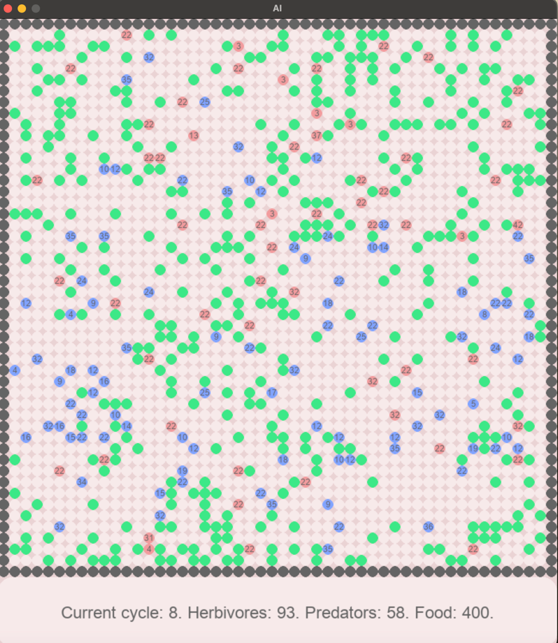
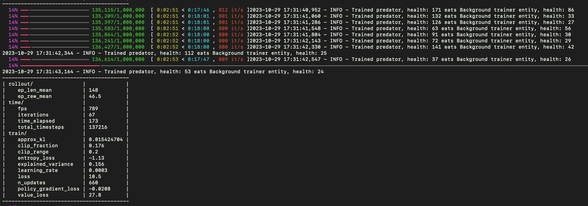

# Project: "Prey and Predator"

This project is dedicated to the investigation and understanding of cyber evolution phenomena using reinforcement learning techniques.

## Overview

Cyber evolution represents the dynamic, ever-changing landscape of digital systems, threats, and security measures. This project leverages reinforcement learning, a subfield of artificial intelligence, to study and model the intricate dynamics of cyber evolution. By applying reinforcement learning algorithms to cybersecurity scenarios, we aim to gain insights into how adaptive strategies develop in response to evolving threats and defenses.

## Key Objectives

- Analyze the dynamics of cyber threats and security measures in digital ecosystems.
- Develop reinforcement learning models that simulate cyber actors and their decision-making processes.
- Investigate the emergence of strategies and adaptations in response to changing threat landscapes.
- Contribute to a deeper understanding of evolving cybersecurity strategies.

# More about the project

In this project, we explore the concept of cyber evolution through the lens of two types of entities:

## Non-living entities:

Edible entities (plants/bushes) that possess a certain amount of nutrition (a numerical value). When herbivores consume these edible entities, they increase their own health based on the nutritional value of the consumed entity.

## Living entities:

- Herbivores, which feed on edible entities.
- Predators, which feed on herbivores.

## How it works: 

Each living entity possesses its own neural network brain, trained using reinforcement learning principles. Each entity observes its environment and makes decisions regarding its next move. Every entity is motivated to survive for as long as possible, and they are rewarded for each additional life cycle. When you run this project, you can train your entities or visualize their evolution. You can witness herbivores learning to identify edible plants and seeking nourishment, predators honing their hunting strategies, and herbivores adapting to threats by avoiding or fleeing from predators.

## Concept of the Environmental Ecosystem:

- The environment is represented by a two-dimensional grid, where each cell can contain only one entity. You can configure the grid's size.
- Every living entity has a limited number of lives.
- When herbivores consume plants, they replenish their health.
- If predators consume herbivores, the herbivores perish, and the predator gains their health.
- Consumption occurs when an entity moves to the cell of another entity it can consume (herbivores can move into empty cells or cells with plants, while predators can move into empty cells or cells with herbivores).
- Predators are represented in red, plants in green, and herbivores in blue.
- Each living entity displays a number representing its remaining lives.
- When an entity's health reaches zero, it dies.
- When a living entity accumulates sufficient health, it can reproduce.
- Each entity can observe its surroundings up to one or two cells away, which can be configured (recommended for herbivores to see one cell and for predators to see two cells for viability).
- Entities can move to any neighboring cell or stay in place, and one life is deducted after each step.
- The game/visualization ends when there are no more living entities or no more room for replication (herbivores may reproduce, filling up the grid).
- The initial population of entities is spawned randomly throughout the grid.
- Larger grids and more entities require higher computational resources.
- The environment operates in cycles. One cycle represents one iteration where each entity perceives its environment and decides its next move. Cycles continue until the game ends.
- A log is displayed in the terminal at the end of each cycle, showing how each entity behaved. This is useful for debugging and hypothesis testing.

## How Entity Replication Occurs:

- Each living entity has its own neural network brain. The brain is trained every X steps with Y intensity (configurable parameters).
- Offspring inherit their type from their parent (herbivores give birth to herbivores, predators give birth to predators), along with their parent's brain and all the experience the parent gained throughout its life.
- This means that offspring continue their development from where they branched off from their parent (the neural network weights are copied). Offspring do not start learning from scratch, providing ample room for experiments and hypotheses about cyber evolution.
- During replication/birth, the parent loses a portion of its lives.
- All replication parameters are configurable, allowing for creative experimentation.

## Modes of Operation

This project offers several modes of operation:

1. **Single Training Mode:** In this mode, you can train a specific model, which you can later reuse in the following modes.
2. **Life Mode:** Entities evolve in real-time from scratch. After a configurable number of steps, each entity initiates background learning, where it lives through a set number of lives. Background learning is necessary as entities require hundreds of thousands of iterations and observations to display life-like behavior, which is not feasible in direct visualization. Each step reflects the results of this learning process. With each new step, entities learn more and become more viable, and their offspring inherit this knowledge.
3. **Life Mode with Pre-trained Models:** You can pre-train models and reuse them, saving time by not starting the training process from scratch. This mode is ideal for hypothesis testing.
4. **Model Training Mode:** Observe how a specific model is trained. After the environment is reset upon the model's death, the model continues evolving from where it left off, without losing progress. This mode allows you to witness the evolution process of your model.

## The Sustainer Abstraction

To address resource exhaustion during training, an auxiliary abstraction called a "sustainer" was introduced. The sustainer can replenish the number of bushes/plants for herbivores when training herbivores, or add the necessary number of predators with specified levels of development. This creates an additional life threat for herbivores, forcing them to learn how to interact with predators (e.g., running away).

## Hypotheses and Theories to Explore

This project provides a platform for investigating various hypotheses and theories, including:

1. The influence of the average entity lifespan based on the environment's nutritional level, the number of predators or herbivores, the number of entity training sessions, and accumulated experience (more trained entities live longer).
2. The impact of entity replication configurations on species survival.
3. How entity density affects their survival.
4. The effect of the field of view (one or two cells around) on entity survival.

## Output and Data for Research

After running the visualization, you'll obtain a "stat.json" file in the statistics module. This file contains snapshots of the environment at different time points, which can be used for your scientific work.

This repository includes pre-trained models, but using this project's API, you can train and save your own models, allowing you to conduct experiments and test your hypotheses.

## Getting Started

Detailed instructions for running the project will be provided in the following sections.

- To run this project, you need to clone the repository, activate the environment, and install all the required libraries listed in the "requirements" file. Follow the instructions for running the project.

Model training Mode. 

While running this mode you can see the model training logs in real time.
You can read more about the model training mode in the stable_baselines3 documentation [here](https://stable-baselines3.readthedocs.io/en/master/guide/examples.html#train-a-model-from-scratch).
The most important metric is the mean reward, which is the average reward per episode. THe reward is the sum of all the rewards obtained during the episode. The higher the mean reward, the better the model is performing.

Command for running this mode: 

    train_the_best_model 

Arguments: 
    
        --width: The width of the grid. 
        --height: The height of the grid. 
        --entity_type: The type of the entity. Herbivore or predator.
        --health_after_birth: The health of the entity after birth. 
        --observation_range: The observation range of the entity. One or two cells around.
        --total_timesteps: The total number of timesteps for training. 
        --path_for_saving: The path for saving the model.

Example: 

    python3 main.py train_the_best_model --width 20 --height 20 --entity_type predator --health_after_birth 10 --observation_range one_cell_around --total_timesteps 1000  --path_for_saving your_model_name

Sustainers will be set automatically based on the entity type in ration 10% of the grid size.

## Collaborators

Feel free to explore our research, experiments, and findings in this repository. You can find our code, datasets, and documentation to replicate our experiments or extend our research. We encourage collaboration and contributions from the open-source community to enhance our understanding of cyber evolution.

## License

This project is licensed under the MIT License. See the [LICENSE](LICENSE.md) file for details.

## Get Involved

We welcome contributions, feedback, and collaboration from researchers, developers, and cybersecurity enthusiasts. If you're interested in participating, please [get in touch](mailto:artemchege@me.com) or submit a pull request.

## Contact

For inquiries or collaboration opportunities, please contact [my email](mailto:artemchege@me.com).

How to run tests: 

    python3 pytest tests/